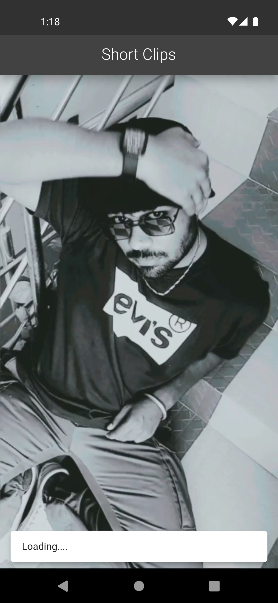

# Clips_snippits

<a href="http://www.youtube.com/watch?v=YOUR_VIDEO_ID_HERE](https://github.com/Uday-kiran9147/clips_snippits/blob/master/assets/video/yt_shorts-intern_demo%20(Uday%20kiran).mp4">
  
</a>

Project to builds a simplified "YouTube Shorts"  mobile application. This application
should allow users to:
1. View a list of predefined short video thumbnails.
2. Click on a thumbnail to play the short video in full screen.
3. Swipe vertically to navigate through videos, similar to the YouTube Shorts or TikTok
interface.

## How To Run
Make sure you have git installed on PC

```bash
git clone https://github.com/Uday-kiran9147/clips_snippits.git
```
Import dependencies run, Make sure you are in project root directory before running below command.
```bash 
flutter pub get
```
Start application using 
```bash 
flutter run
